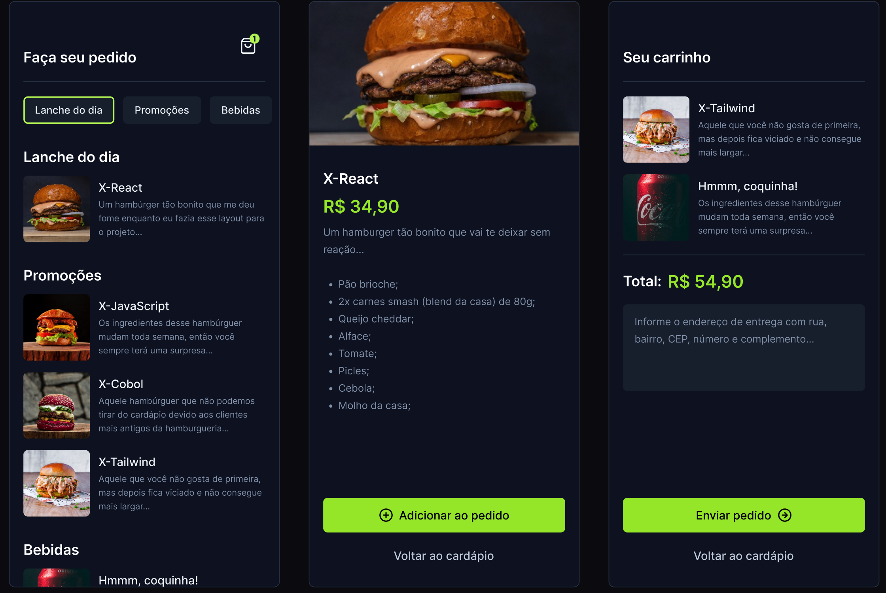

<h1 align="center"> Orders App </h1>

  

 

  

## 🚀 Tecnologias

Esse projeto foi desenvolvido com as seguintes tecnologias:

- React Native
- TypeScript
- Tailwind CSS
- Expo GO
- Git e Github
- Figma

## 💻 Projeto

O Orders App é um aplicativo de pedidos de comida, onde o usuário pode escolher o prato que deseja, adicionar ao carrinho e finalizar o pedido.

- [Visite o projeto online!](https://github.com/ArturRSA19/Orders-App)

## 🔖 Layout

Você pode visualizar o layout do projeto através [DESSE LINK](https://www.figma.com/file/kRpcmr3sKKtf4YQgRif8xa/NLW-expert-•-Orders-(Community)?type=design&node-id=2-287&mode=design&t=5OS9By3CTlB2OIV6-0). É necessário ter conta no [Figma](https://figma.com) para acessá-lo.

## :memo: Licença

Esse projeto está sob a licença MIT.

---
